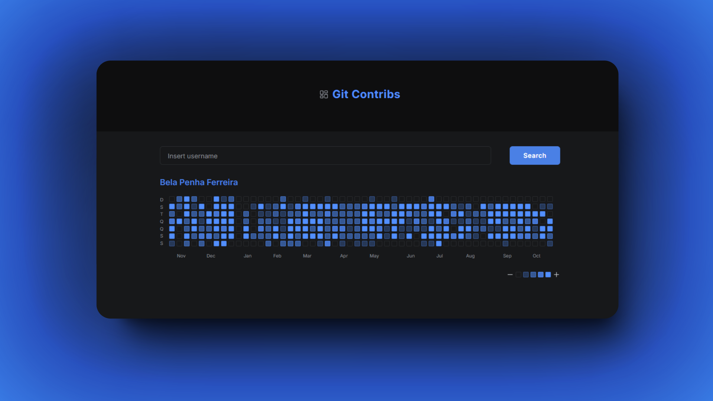

<p align="center">
  <h1>Git Contribs</h1>
</p>


<p align="center">
  <strong>
    A heatmap component displaying one's GitHub contributions
  </strong>
</p>

> [!IMPORTANT]
> 👉🏻 Access: [https://belapferreira.github.io/github-contributions-collection/](https://belapferreira.github.io/github-contributions-collection/).

<p>&nbsp;</p>

<p align="center">
  
</p>

<p>&nbsp;</p>

<p align="center">
  

  

  
</p>

<p align="center">
  <a href="#gear-settings">Settings</a>&nbsp;&nbsp;&nbsp;|&nbsp;&nbsp;&nbsp;
  <a href="#arrow_down_small-cloning-the-repository">Cloning the repository</a>&nbsp;&nbsp;&nbsp;|&nbsp;&nbsp;&nbsp;
  <a href="#beginner-starting-the-application">Starting the application</a>&nbsp;&nbsp;&nbsp;|&nbsp;&nbsp;&nbsp;
  <a href="#wrench-techs--tools--resources">Techs | Tools | Resources</a>&nbsp;&nbsp;&nbsp;|&nbsp;&nbsp;&nbsp;
  <a href="#memo-license">License</a>
</p>

### :pushpin: Context

At the end of 2020, during one of the first hiring processes I participated in, the challenge was developing a kind of clone of the GitHub contributions heatmap. I made it, using a library, and the idea was to create it from scratch. And guess what: I didn't move forward in the process 😅.

Earlier this year (2024), I was assigned to implement the components of a profile page, one of which was a heatmap. This time, as I improved my skills, I could build it from scratch.

And I just wanted to reproduce part of that here as a way to say to my past self thank you for keeping going and to my current, and fortunately to my future self, never stop learning! 🍀💙


### :gear: Settings

The settings to execute the application on your computer are listed below.

- [Git](https://git-scm.com);
- [Node](https://nodejs.org/);
- [Yarn](https://yarnpkg.com/).

### :arrow_down_small: Cloning the repository

1. Through the terminal, go to the directory where you want to have the repository cloned and run the following command:

```bash
# cloning the repository
git clone https://github.com/belapferreira/github-contributions-collection
```

### :beginner: Starting the application

1. Open the code of the repo cloned, create a `.env.local` file and add the variables `NEXT_PUBLIC_GITHUB_GRAPHQL_API_URL` and `NEXT_PUBLIC_GITHUB_TOKEN` (the GitHub GraphQL API URL is https://api.github.com/graphql and the `token` you must generate one).

2. Through the terminal, go to the directory where the repository was cloned and run the following command:

```bash
# installing dependencies
yarn install

# starting application
yarn dev
```

### :wrench: Techs | Tools | Resources

This project was developed using the following resources:

[Date FNS](https://date-fns.org/) | [Eslint](https://eslint.org/) | [Lucide React](https://lucide.dev/guide/packages/lucide-react) | [Next.js](https://nextjs.org/) | [Prettier](https://prettier.io/) | [Radix UI](https://www.radix-ui.com/) | [Tailwindcss](https://tailwindcss.com/) | [TypeScript](https://www.typescriptlang.org/)


### :memo: License

This project is under MIT license. See [LICENSE](https://github.com/belapferreira/github-contributions-collection/blob/master/LICENSE) for more information.

---

Developed by Bela Ferreira :blue_heart: Contact: https://www.linkedin.com/in/belapferreira :blush:
